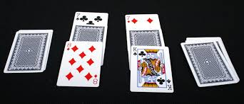

# War Game - JS Browser Game

## Game Overview:

"War" is a classic card game played between two players, where the goal is to win all the cards. The game involves drawing cards from each player's deck and comparing their values to determine the winner of each round. The game features special rules for "war," where cards of equal value lead to a tie-breaking scenario.

## Getting Started - Gameplay

1. The player is shown the instructions and rules for the game and click's the `start` button.

1. **Deck and Game Setup**:

   - A standard deck of cards is created, shuffled, and split evenly between the player and the computer.

1. **Gameplay**:

   - Players draw cards from their respective decks.
   - The card with the higher value wins the round and is added to the winner's deck.
   - If cards of equal value are drawn, a "war" is declared where additional cards are drawn to determine the round's winner.

1. **War Phase**:

   - In the event of a tie (war), each player places additional cards face-down and then draws another card to resolve the war.
   - The player with the higher value card wins all the cards involved in the war.

1. **Winning the Game**:
   - The game will until on of the players has all the cards, or if a specific game-ending condition is met (e.g., not enough cards to continue a war).

## Attributions

- [Shuffle Function - Used in Deck Class](https://stackoverflow.com/questions/2450954/how-to-randomize-shuffle-a-javascript-array) 

## Technologies Used

1. JavaScript
   1. setTimeout
   1. Vanilla JS - DOM
1. HTML
1. CSS

## Next Steps

- Explore CSS [Tailwind CSS](https://tailwindcss.com/)
- Timers for UI changes
- Animated background GIFs
